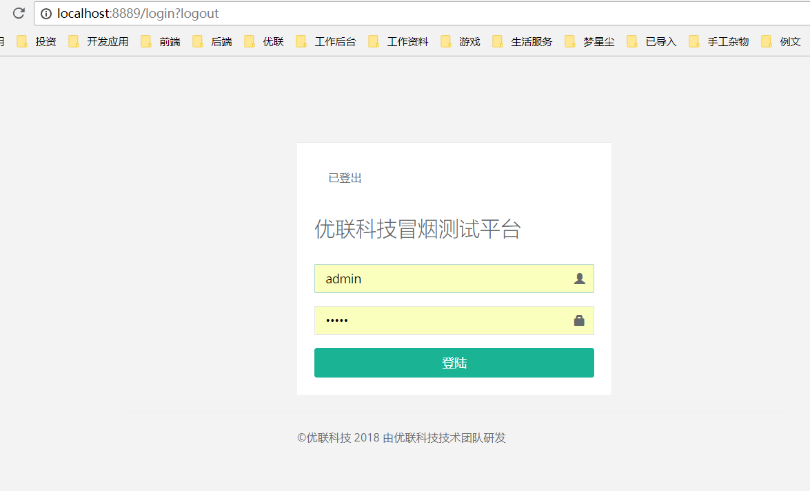
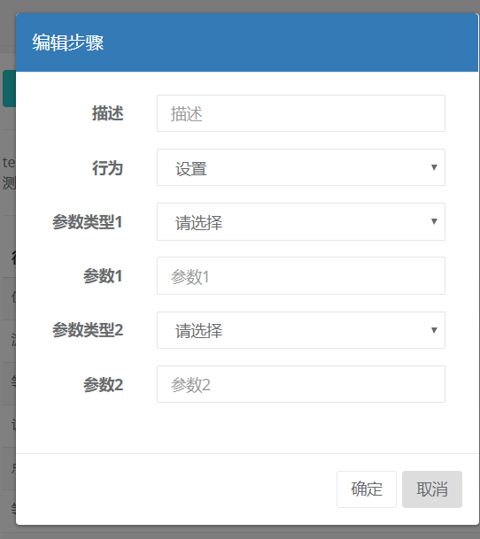
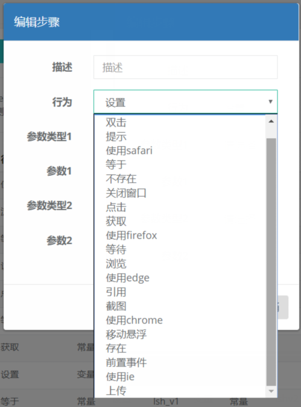
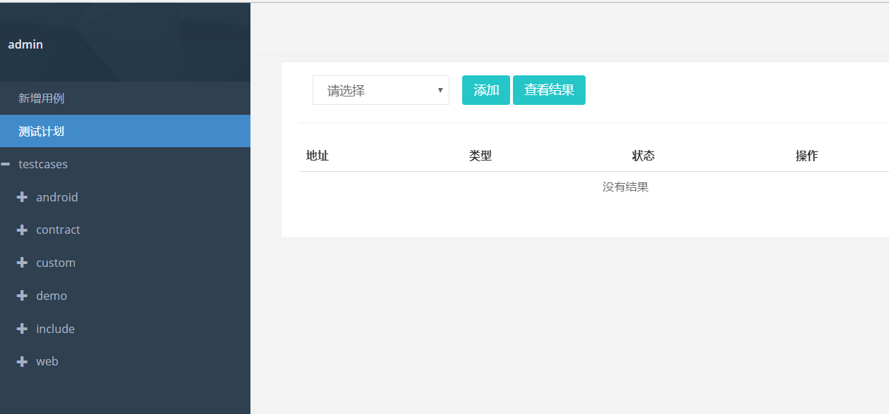
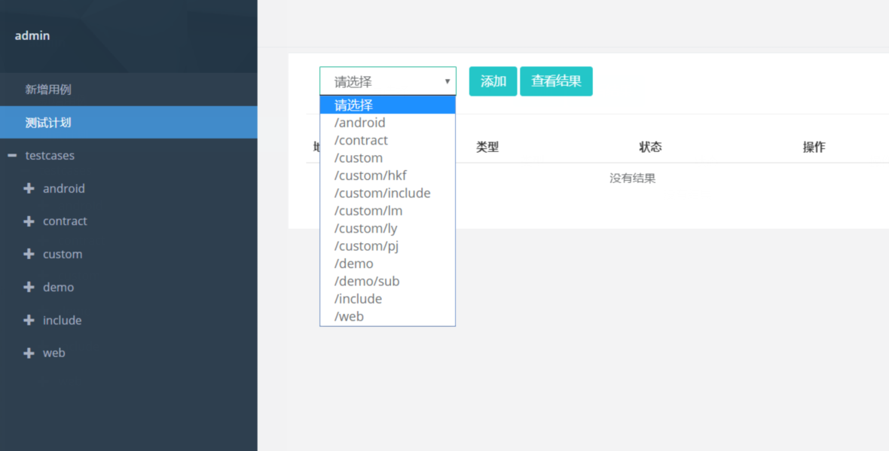
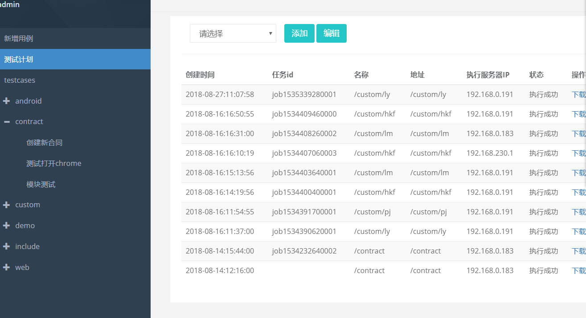

## 项目起源
    本框架源于本人在前面项目中的需求，当时花了2周时间做出的原型。
    在优联科技，为了完成自动化测试的案例，这个项目又搬了出来，
    其中刘明、彭杰都有代码贡献，2位同学联合刘远、胡凯峰编写了大量的测试用例。
    
## 项目简介

Selenium 是一个用于Web应用程序测试的工具，通过模拟用户操作能完成对业务场景的测试，同时还能对浏览器兼容性做出测试。用它做自动化测试案例的编写，对项目快速迭代过程中的回归测试起到了很大的作用。

但我们在使用的同时，也发现出现了这样几个问题:

-	需要案例编写人有一定的编码能力，这对于很多测试人员来说也是个不小的门槛。
-	没有提供统一的案例编排功能，如果需要切换测试浏览器，必须重构代码。
-	缺乏分布式能力，如果案例过多，无法自动完成并发式的测试。

基于以上几点问题，jieyee于是开发出了一个基于selenium的自动化测试框架。

这个项目有以下几个特点：
-	无需编码，通过向导设置步骤来完成测试案例的编写。几乎大部分常用的操作都可以通过设置功能和参数的方式完成，降低了案例编写门槛，也可以选择文本的方式编辑。
同时也保留了扩展功能，以方便自己扩展没有的操作功能。
案例运行完成后还会生成日志文件提供下载。
-	提供了案例的编排功能，这样得以能够完成多个测试案例的连续测试，同时参数化了案例运行的浏览器，这样即使切换成其他测试浏览器，只需要修改一下参数就能完成全部案例的切换。同时提供了统一的日志文件以查看测试结果。
-	通过连接kafka获得了集群分布式运行的能力，每个运行项目的实例都会自动从kafka获取案例运行，达到并发测试的目的。

## 项目技术说明
- 支持按文本方式编写测试用例
- 支持向导方式编写用例
- 支持集群，需要安装kafka，mysql
- 日志可导出
 
## 使用过程

1. 项目启动默认端口8889,登录页面

2. 新增用例

 

3. 用例编辑

 

 

-文本模式编辑 

 

4.测试计划
 

 

 

5.日志
 

## 问题反馈
- 刘明 mingcell@163.com
- 彭杰 1018518182@qq.com
- 周明 jieyee@163.com
